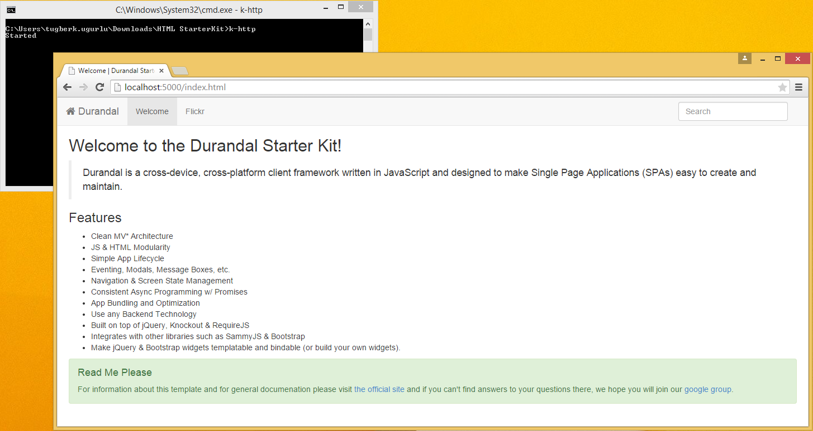

# k-http

Command-line HTTP server suitable for testing and local development to host static files with zero configuration. Written on top of ASP.NET 5 and inspired by nodejs [http-server](http://www.tugberkugurlu.com/archive/quickly-hosting-static-files-in-your-development-environment-with-node-http-server).

### Installation

- This is tested under **dnx 1.0.0-beta5** from offical beta5 release on NuGet.org feed **(https://nuget.org/api/v2/)**. Make sure this is active feed before installing.
- To install this globally, run the following command after you make sure that you have the correct dnx version active: `dnu commands install k-http`.
- You should have **k-http** under your path now. Run this under the desired directory to expose the static files through http://localhost:5000
- You can override the URL using `--server-urls` command line argument: `k-http --server.urls=http://localhost:5005`

After you have it globally installed, you Can run `k-http` under the directory which needs to be hosted:

